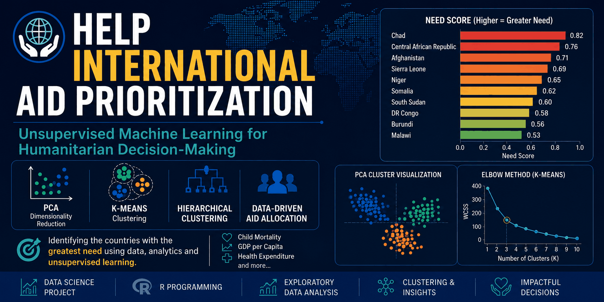

<p align="center">
  
</p>

# HELP International: Aid Prioritization Using Unsupervised Learning

## Project Overview

HELP International, a humanitarian NGO, raised **$10 million** and needed a data-driven way to identify countries that should receive aid first.

This project applies **unsupervised machine learning** to group countries based on socio-economic and health indicators, then recommends the countries with the highest need for funding support.

The analysis combines **data preprocessing, exploratory data analysis, PCA, K-means clustering, hierarchical clustering, silhouette validation, cluster profiling, and need-score ranking**.

---

## Live Report

View the knitted HTML report here:

**[Open the Professional HTML Report](https://eliya-nandi.github.io/Help-International-Aid-Prioritization/)**

---

## Business Problem

Aid allocation is a multidimensional decision. A country may require support because of high child mortality, low GDP per capita, weak health expenditure, low income, poor life expectancy, or limited economic capacity.

The goal of this project is to help HELP International answer:

> **Which countries should be prioritized for aid based on socio-economic and health indicators?**

---

## My Role

**Data Scientist / Machine Learning Analyst**

I handled the complete analytical workflow:

- Cleaned and prepared the country-level socio-economic dataset
- Engineered policy-relevant variables by converting trade and health percentages into GDP-based actual values
- Performed exploratory data analysis to understand skewness, scale differences, and outliers
- Applied PCA for dimensionality reduction
- Compared hierarchical clustering and K-means clustering
- Evaluated cluster quality using silhouette scores
- Profiled clusters using GDP, income, health expenditure, exports, and child mortality
- Built a need-score ranking to identify the highest-priority countries for aid allocation
- Translated model outputs into actionable recommendations for decision-makers

---

## Dataset

The dataset contains **167 countries** and **9 numeric socio-economic and health indicators**, plus the country name.

| Column | Description |
|---|---|
| `country` | Name of the country |
| `child_mort` | Deaths of children under 5 years of age per 1,000 live births |
| `exports` | Exports of goods and services per capita, originally given as % of GDP per capita |
| `health` | Total health spending per capita, originally given as % of GDP per capita |
| `imports` | Imports of goods and services per capita, originally given as % of GDP per capita |
| `income` | Net income per person |
| `inflation` | Annual growth rate of total GDP |
| `life_expec` | Average life expectancy |
| `total_fer` | Fertility rate |
| `gdpp` | GDP per capita |

---

## Methodology

### 1. Data Preprocessing

The raw data was prepared for clustering by:

- Checking missing values
- Converting `exports`, `imports`, and `health` from percentages of GDP into actual values
- Standardizing numeric features using Z-score normalization
- Identifying outliers using boxplots and multivariate Z-score distance

### 2. Exploratory Data Analysis

EDA was used to understand:

- Feature distributions
- Skewness in economic indicators
- Scale differences between variables
- Outlying countries
- Correlation structure among socio-economic indicators

### 3. Dimensionality Reduction

PCA was used to reduce the original variables into a smaller set of components.

Key PCA result:

- The first **4 principal components** retained approximately **93.37%** of the total variance.
- PCA was selected as the main dimensionality reduction method because the dataset showed strong linear correlation patterns and PCA provides interpretable components.

An autoencoder was also explored as a non-linear dimensionality reduction method, but PCA was preferred for interpretability and stability.

### 4. Clustering Algorithms

Two clustering methods were applied:

#### Hierarchical Clustering

- Distance: Euclidean distance
- Linkage: Ward.D2
- Final clusters: `k = 4`
- Average silhouette width: approximately **0.47**

#### K-means Clustering

- Final clusters: `k = 4`
- Initialization: `nstart = 25`
- Average silhouette width: approximately **0.43**

### 5. Cluster Profiling

Clusters were interpreted using original socio-economic indicators:

| Cluster Type | Interpretation |
|---|---|
| High-need cluster | Low GDP, low income, low health spending, high child mortality |
| Lower-middle development cluster | Moderate need, improving health and economic indicators |
| High-development cluster | Strong economic and health indicators |
| Extreme high-development outlier cluster | Very high GDP/trade/health spending, not aid targets |

---

## Key Findings

- The data contains strong development-related patterns across GDP, income, health expenditure, child mortality, fertility, and life expectancy.
- PCA reduced the dataset effectively while preserving most of the information.
- Hierarchical clustering produced interpretable country groups and slightly stronger silhouette performance than K-means.
- The highest-need cluster contained countries with very high child mortality, low GDP per capita, low income, and low health expenditure.
- Luxembourg and Singapore appeared as extreme high-development outliers and were excluded from aid prioritization.

---

## Aid Prioritization Recommendation

The analysis recommends that HELP International should prioritize countries in the highest-need cluster.

A need score was created using:

```text
Need Score = z(child_mortality) - z(GDP per capita) - z(health expenditure)
```

Higher need score means higher priority.

Top-priority countries identified include:

- Haiti
- Sierra Leone
- Central African Republic
- Chad
- Mali
- Niger

These countries combine high child mortality with weak economic and health-system capacity.

---

## Suggested $10M Allocation Strategy

| Allocation | Target Group | Purpose |
|---|---|---|
| 70-80% | Highest-need cluster | Maternal/child health, nutrition, vaccination, basic healthcare access |
| 20-30% | Moderate-need cluster | Health-system strengthening, water/sanitation, prevention, resilience |
| 0% | High-development and outlier clusters | Not direct humanitarian aid targets |

---

## Technologies Used

- **R**
- **tidyverse**
- **ggplot2**
- **skimr**
- **ggcorrplot**
- **factoextra**
- **cluster**
- **keras3**
- **R Markdown**

---

## Repository Structure

```text
help-international-aid-prioritization/
|
|-- data/
|   |-- Country-data.csv
|
|-- src/
|   |-- aid_prioritization_analysis.R
|
|-- reports/
|   |-- aid_prioritization_report.Rmd
|   |-- aid_prioritization_report.html
|
|
|-- outputs/
|   |-- aid_prioritization_report.html
|   |-- figures/
|
|
|-- index.html
|-- requirements.R
|-- .gitignore
|-- README.md
```

---

## Report Files

The repository includes both:

- `reports/aid_prioritization_report.Rmd` — the editable R Markdown source file
- `reports/aid_prioritization_report.html` — the knitted professional HTML report ready to view in a browser
- `outputs/aid_prioritization_report.html` — the GitHub Pages version of the HTML report

---

## How to Run the Project

### Option 1: Install Required Packages

```r
source("requirements.R")
```

### Option 2: Run the R Script

```r
source("src/aid_prioritization_analysis.R")
```

### Option 3: Knit the R Markdown Report

Open:

```text
reports/aid_prioritization_report.Rmd
```

Then click **Knit** in RStudio to generate the HTML report.

You can also open the already-generated report directly:

```text
reports/aid_prioritization_report.html
```

Before knitting, make sure the dataset is available at:

```text
data/Country-data.csv
```

or update the `data_path` parameter in the R Markdown file.


---

## Limitations

- Clustering results can be sensitive to outliers.
- The choice of `k = 4` is supported by dendrogram and silhouette analysis, but other values could also be explored.
- The dataset does not include all possible aid-related factors such as governance, conflict, population size, inequality, or humanitarian access.
- PCA is linear and may not capture all non-linear structures.

---

## Future Improvements

- Compare additional clustering methods such as Gaussian Mixture Models, DBSCAN, or HDBSCAN
- Use robust scaling or outlier treatment
- Add external indicators such as governance, conflict, population, education, or infrastructure data
- Perform cluster stability analysis using bootstrapping
- Build an interactive dashboard for decision-makers

---

## Author

**Eliya Christopher Nandi**  
Data Scientist | AI & Machine Learning Enthusiast  
Email: [eliyanandi07@gmail.com](mailto:eliyanandi07@gmail.com)  
GitHub: [Eliya-Nandi](https://github.com/Eliya-Nandi)
